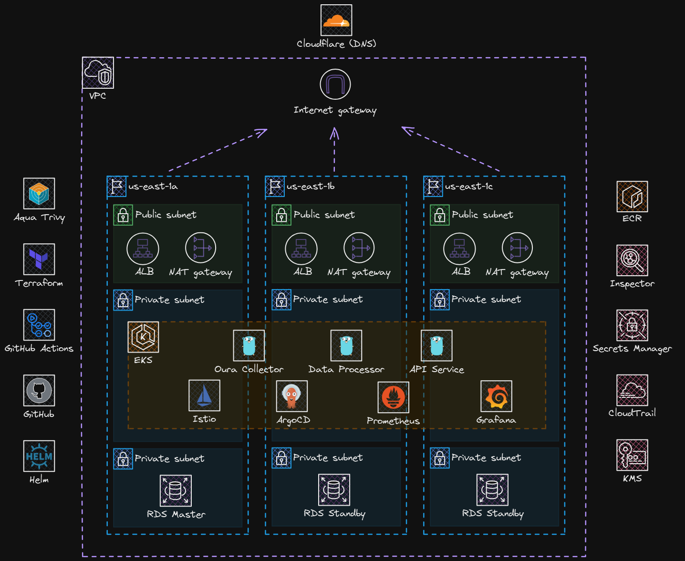

# myHealth - Oura Ring Health Monitoring Platform

[](https://go.dev/)
[](https://kubernetes.io/)
[](https://www.terraform.io/)

A production-grade, cloud-native microservices platform for collecting, processing, and visualizing health metrics from the Oura Ring API. Built with Kubernetes on AWS EKS, this system provides comprehensive monitoring of sleep, activity, and readiness data with enterprise-level observability.

---

## 🎯 Overview

myHealth is a personal health monitoring solution that integrates with the Oura Ring API to collect daily health metrics and provides a powerful analytics platform. The system is designed with cloud-native principles, featuring microservices architecture, automated CI/CD, and production-grade disaster recovery.

### Key Features

- **🔐 OAuth2 Authentication**: Full OAuth2 authorization code flow with automatic token refresh
- **🔒 Secure User Management**: JWT-based authentication with bcrypt password hashing
- **📊 Real-time Data Collection**: Automated daily collection of sleep, activity, and readiness metrics
- **📈 Advanced Visualizations**: Pre-built Grafana dashboards for comprehensive health insights
- **⚡ Auto-scaling**: Horizontal Pod Autoscaler for dynamic resource management
- **🛡️ Production-Ready Infrastructure**: Multi-AZ RDS, automated backups, deletion protection
- **🚀 CI/CD Pipeline**: Conditional builds with GitHub Actions - only build what changed
- **📡 Service Mesh**: Istio for traffic management, security, and observability
- **🔍 Full Observability**: Prometheus metrics, Grafana dashboards, and service monitoring
- **💾 Database Migrations**: Versioned schema management with golang-migrate
- **🌐 API Gateway**: RESTful API with comprehensive endpoint coverage

---

## 🏗️ Architecture

### High-Level Architecture



### Microservices

#### 1. **oura-collector** (CronJob)
- **Purpose**: Scheduled data collection from Oura API
- **Schedule**: Daily at 1:00 AM UTC
- **Features**:
  - OAuth2 token management with automatic refresh
  - Fetches sleep, activity, and readiness metrics
  - Database-driven token storage
  - Graceful error handling and retry logic

#### 2. **data-processor** (Deployment)
- **Purpose**: Data ingestion, validation, and storage
- **Replicas**: 2-5 (HPA based on CPU)
- **Features**:
  - RESTful HTTP API for data ingestion
  - PostgreSQL integration with connection pooling
  - Data transformation and validation
  - Prometheus metrics endpoint

#### 3. **api-service** (Deployment)
- **Purpose**: Public-facing REST API
- **Replicas**: 3-10 (HPA based on requests)
- **Features**:
  - OAuth2 authorization/callback endpoints
  - User registration and login (JWT)
  - Protected API endpoints with auth middleware
  - Comprehensive metric query endpoints
  - Health check and Prometheus metrics

---

## 🛠️ Technology Stack

### Infrastructure & Platform
| Technology | Version | Purpose |
|-----------|---------|---------|
| **AWS EKS** | 1.33+ | Kubernetes orchestration |
| **Terraform** | 1.14+ | Infrastructure as Code |
| **Helm** | 3.13+ | Kubernetes package management |
| **Istio** | 1.23+ | Service mesh (traffic, security, observability) |
| **AWS RDS** | PostgreSQL 15.4 | Relational database (Multi-AZ) |
| **AWS ECR** | - | Container image registry |
| **AWS Secrets Manager** | - | Secrets and credentials management |

### Application Stack
| Technology | Purpose |
|-----------|---------|
| **Go** 1.25+ | Microservices development |
| **gorilla/mux** | HTTP routing |
| **pgx/v5** | PostgreSQL driver with connection pooling |
| **golang-jwt/jwt/v5** | JWT token generation and validation |
| **golang.org/x/crypto** | bcrypt password hashing |
| **sirupsen/logrus** | Structured JSON logging |
| **prometheus/client_golang** | Metrics instrumentation |

### Monitoring & Observability
| Technology | Purpose |
|-----------|---------|
| **Prometheus** | Metrics collection and storage |
| **Grafana** | Visualization and dashboards |
| **ServiceMonitor** | Automatic service discovery for metrics |
| **Istio Telemetry** | Distributed tracing and service mesh observability |

### CI/CD & GitOps
| Technology | Purpose |
|-----------|---------|
| **GitHub Actions** | CI/CD automation |
| **Docker** | Container builds (multi-stage) |
| **External Secrets Operator** | Kubernetes secrets synchronization |

---

## 📁 Project Structure

```
myapp-kubernetes/
├── .github/
│   └── workflows/
│       ├── build-all-services.yml      # Conditional service builds
│       ├── build-service.yml           # Reusable build workflow
│       ├── deploy-dev.yml              # Dev environment deployment
│       ├── deploy-staging.yml          # Staging deployment
│       └── deploy-prod.yml             # Production deployment
│
├── terraform/
│   ├── main.tf                         # Main orchestration
│   ├── variables.tf                    # Input variables
│   ├── outputs.tf                      # Infrastructure outputs
│   ├── providers.tf                    # AWS provider config
│   └── modules/
│       ├── eks/                        # EKS cluster with IRSA
│       ├── networking/                 # VPC, subnets, security groups
│       ├── rds/                        # PostgreSQL with Multi-AZ
│       ├── ecr/                        # Container registries
│       └── secrets-manager/            # Secrets storage
│
├── services/
│   ├── oura-collector/
│   │   ├── cmd/main.go                 # CronJob entry point
│   │   ├── internal/
│   │   │   ├── client/                 # Oura API client
│   │   │   └── config/                 # Configuration
│   │   ├── Dockerfile                  # Multi-stage build
│   │   └── go.mod
│   │
│   ├── data-processor/
│   │   ├── cmd/main.go                 # HTTP server
│   │   ├── internal/
│   │   │   ├── handler/                # HTTP handlers
│   │   │   ├── repository/             # Database layer
│   │   │   └── config/
│   │   ├── migrations/                 # golang-migrate SQL files
│   │   │   ├── 000001_create_users_and_oauth.up.sql
│   │   │   ├── 000001_create_users_and_oauth.down.sql
│   │   │   ├── 000002_create_metrics_tables.up.sql
│   │   │   └── 000002_create_metrics_tables.down.sql
│   │   ├── Dockerfile
│   │   └── go.mod
│   │
│   ├── api-service/
│   │   ├── cmd/main.go                 # REST API server
│   │   ├── internal/
│   │   │   ├── handler/                # API handlers
│   │   │   ├── oauth/                  # OAuth2 flow implementation
│   │   │   ├── user/                   # User registration/login
│   │   │   ├── auth/                   # JWT middleware
│   │   │   ├── repository/             # Data access
│   │   │   └── config/
│   │   ├── Dockerfile
│   │   └── go.mod
│   │
│   └── shared/                         # Shared libraries
│       ├── database/                   # Connection pooling
│       ├── logger/                     # Structured logging
│       └── metrics/                    # Prometheus metrics (singleton)
│
├── helm/
│   └── myhealth/
│       ├── Chart.yaml                  # Helm chart metadata
│       ├── values.yaml                 # Configuration values
│       ├── dashboards/
│       │   ├── oura-metrics.json       # Grafana dashboard
│       │   └── service-health.json     # Service monitoring dashboard
│       └── templates/
│           ├── namespace.yaml
│           ├── serviceaccount.yaml
│           ├── externalsecrets.yaml    # AWS Secrets sync
│           ├── api-service/
│           │   ├── deployment.yaml
│           │   ├── service.yaml
│           │   ├── hpa.yaml
│           │   └── servicemonitor.yaml
│           ├── data-processor/
│           ├── oura-collector/
│           │   ├── cronjob.yaml
│           │   └── servicemonitor.yaml
│           ├── istio/
│           │   ├── gateway.yaml
│           │   ├── virtualservice.yaml
│           │   └── destinationrule.yaml
│           ├── prometheus/
│           │   ├── configmap.yaml
│           │   └── alerts.yaml
│           └── grafana/
│               ├── configmap-datasources.yaml
│               └── configmap-dashboards.yaml
│
└── docs/
    ├── PROJECT_PLAN.md                 # Complete architecture guide
    ├── OAUTH_AND_AUTH_IMPLEMENTATION.md # OAuth2 & auth setup
    ├── IMPLEMENTATION_GUIDE.md         # Development guide
    └── DOCUMENTATION_INDEX.md          # Docs navigation
```

---


## 📊 API Endpoints

### Authentication

| Method | Endpoint | Description | Auth Required |
|--------|----------|-------------|---------------|
| POST | `/api/register` | Register new user | No |
| POST | `/api/login` | Login and receive JWT | No |
| GET | `/api/me` | Get current user profile | Yes |

### OAuth2

| Method | Endpoint | Description | Auth Required |
|--------|----------|-------------|---------------|
| GET | `/api/oauth/authorize` | Initiate OAuth2 flow | Yes |
| GET | `/api/callback` | OAuth2 callback handler | No |
| POST | `/api/oauth/refresh` | Manually refresh token | Yes |

### Metrics

| Method | Endpoint | Description | Auth Required |
|--------|----------|-------------|---------------|
| GET | `/api/dashboard` | Dashboard summary | Yes |
| GET | `/api/sleep` | Sleep metrics | Yes |
| GET | `/api/activity` | Activity metrics | Yes |
| GET | `/api/readiness` | Readiness metrics | Yes |

### Health & Monitoring

| Method | Endpoint | Description |
|--------|----------|-------------|
| GET | `/health` | Service health check |
| GET | `/metrics` | Prometheus metrics |

---

## 🔐 Security Features

### Authentication & Authorization
- **bcrypt Password Hashing**: 10+ rounds for secure password storage
- **JWT Tokens**: 24-hour expiration with HS256 signing
- **OAuth2 Authorization Code Flow**: Secure Oura API integration
- **Auth Middleware**: Protects all sensitive endpoints

### Infrastructure Security
- **AWS Secrets Manager**: Centralized secrets management
- **IAM Roles for Service Accounts (IRSA)**: Pod-level AWS permissions
- **Security Groups**: Restricted network access
- **RDS Encryption**: At-rest encryption with KMS
- **SSL/TLS**: Required for all database connections in production

### Network Security
- **Istio Service Mesh**: mTLS between services
- **Private Subnets**: Database and worker nodes isolated
- **NAT Gateway**: Controlled egress traffic

---

## 📈 Monitoring & Observability

### Prometheus Metrics

All services expose metrics on `/metrics`:
- HTTP request duration and count
- Database query performance
- OAuth token refresh operations
- Error rates and types
- Go runtime metrics (goroutines, memory, GC)

### Grafana Dashboards

**1. Oura Metrics Dashboard**
- Sleep score trends (7d, 30d, 90d)
- Activity summary (steps, calories)
- Readiness score tracking
- HRV trends

**2. Service Health Dashboard**
- Request rate per service
- Latency percentiles (p50, p95, p99)
- Error rates
- Pod status and restart counts
- Database connection pool usage

### ServiceMonitors

Automatic Prometheus scraping configuration for:
- api-service
- data-processor
- oura-collector

---

## 🔄 CI/CD Pipeline

### Conditional Builds

The pipeline uses path filtering to only build services that have changed:

```yaml
# Only builds api-service if files in services/api-service/** changed
# Only builds data-processor if files in services/data-processor/** changed
# Only builds oura-collector if files in services/oura-collector/** changed
```

### Build Pipeline

1. **Code Changes Detected** → GitHub Actions triggered
2. **Go Tests** → Run unit tests with coverage
3. **Docker Build** → Multi-stage build for optimized images
4. **ECR Push** → Tagged with git SHA and `latest`
5. **Notification** → ntfy.sh alerts on success/failure

### Deployment Environments

- **Dev**: Auto-deploy on merge to `main`
- **Staging**: Auto-deploy on merge to `staging` branch
- **Production**: Manual approval required

---

## 💾 Database Schema

### Users Table
```sql
CREATE TABLE users (
    user_id UUID PRIMARY KEY DEFAULT uuid_generate_v4(),
    username VARCHAR(50) UNIQUE NOT NULL,
    email VARCHAR(255) UNIQUE NOT NULL,
    password_hash TEXT NOT NULL,
    created_at TIMESTAMP DEFAULT NOW(),
    updated_at TIMESTAMP DEFAULT NOW(),
    is_active BOOLEAN DEFAULT TRUE
);
```

### OAuth Tokens Table
```sql
CREATE TABLE oauth_tokens (
    id SERIAL PRIMARY KEY,
    user_id UUID REFERENCES users(user_id) ON DELETE CASCADE,
    access_token TEXT NOT NULL,
    refresh_token TEXT NOT NULL,
    token_type VARCHAR(50) DEFAULT 'Bearer',
    expires_at TIMESTAMP NOT NULL,
    created_at TIMESTAMP DEFAULT NOW(),
    updated_at TIMESTAMP DEFAULT NOW()
);
```

### Metrics Tables
- `sleep_metrics`: Sleep duration, efficiency, stages, HRV
- `activity_metrics`: Steps, calories, training frequency
- `readiness_metrics`: Readiness score, contributors

See `services/data-processor/migrations/` for complete schema.

---

## 🛡️ Disaster Recovery

### Production Configuration

When `environment = "prod"`:
- **Multi-AZ RDS**: Automatic failover to standby instance
- **30-Day Backups**: Automated daily snapshots
- **Deletion Protection**: Prevents accidental database deletion
- **Final Snapshot**: Created before any destroy operation

### Backup Strategy

- **RDS Automated Backups**: Daily snapshots, 30-day retention
- **Point-in-Time Recovery**: Up to 30 days
- **CloudWatch Logs**: PostgreSQL and upgrade logs retained
- **Infrastructure State**: Terraform state in S3 with versioning

### Recovery Procedures

See `docs/DISASTER_RECOVERY.md` for detailed recovery procedures.

---

## 🧪 Development

### Local Development Setup

```bash
# Clone repository
git clone https://github.com/asian-code/myapp-kubernetes.git
cd myapp-kubernetes

# Set up Go workspace
cd services
go work use ./api-service ./data-processor ./oura-collector ./shared

# Run tests
cd api-service
go test -v -race -coverprofile=coverage.out ./...

# Build locally
go build -o bin/api-service ./cmd/main.go
```

### Running Tests

```bash
# All services
cd services
go test ./...

# With coverage
go test -race -coverprofile=coverage.out ./...
go tool cover -html=coverage.out
```

### Building Docker Images

```bash
# Build api-service
docker build -t api-service:local -f services/api-service/Dockerfile services/

# Build and run locally
docker run -p 8080:8080 \
  -e DB_HOST=localhost \
  -e DB_PASSWORD=test \
  api-service:local
```

---

## 📋 Configuration

### Environment Variables

#### api-service
- `DB_HOST`, `DB_PORT`, `DB_USER`, `DB_PASSWORD`, `DB_NAME`
- `JWT_SECRET`: Secret for signing JWT tokens
- `OURA_CLIENT_ID`, `OURA_CLIENT_SECRET`: OAuth2 credentials
- `OURA_REDIRECT_URI`: OAuth2 callback URL
- `LOG_LEVEL`: debug, info, warn, error
- `SSL_MODE`: disable (dev), require (prod)

#### data-processor
- `DB_HOST`, `DB_PORT`, `DB_USER`, `DB_PASSWORD`, `DB_NAME`
- `LOG_LEVEL`
- `SSL_MODE`

#### oura-collector
- `DB_HOST`, `DB_PORT`, `DB_USER`, `DB_PASSWORD`, `DB_NAME`
- `USER_ID`: User ID for token lookup
- `PROCESSOR_URL`: data-processor service URL
- `LOG_LEVEL`
- `SSL_MODE`

See `helm/myhealth/values.yaml` for complete configuration options.

---

## 🐛 Troubleshooting

### Common Issues

**Issue**: OAuth2 authorization fails
```bash
# Check redirect URI matches Oura app configuration
kubectl logs -n myhealth -l app=api-service --tail=100

# Verify secrets are loaded
kubectl get externalsecrets -n myhealth
kubectl describe externalsecret myhealth-oura-credentials -n myhealth
```

**Issue**: Database connection failures
```bash
# Check RDS security group
aws ec2 describe-security-groups --group-ids <rds-sg-id>

# Verify SSL mode
kubectl get configmap -n myhealth -o yaml | grep SSL_MODE

# Test connection from pod
kubectl exec -it -n myhealth deployment/api-service -- /bin/sh
psql "host=$DB_HOST port=5432 user=$DB_USER dbname=$DB_NAME sslmode=require"
```

**Issue**: CronJob not collecting data
```bash
# Check CronJob status
kubectl get cronjobs -n myhealth
kubectl get jobs -n myhealth

# View logs
kubectl logs -n myhealth -l app=oura-collector --tail=50

# Verify user_id is set
kubectl describe cronjob oura-collector -n myhealth | grep USER_ID
```

For more troubleshooting, see `docs/OAUTH_AND_AUTH_IMPLEMENTATION.md`.

---

## 📚 Documentation

- **[Project Plan](docs/PROJECT_PLAN.md)**: Complete architecture and design
- **[OAuth & Auth Guide](docs/OAUTH_AND_AUTH_IMPLEMENTATION.md)**: Authentication setup
- **[Implementation Guide](docs/IMPLEMENTATION_GUIDE.md)**: Phase-by-phase development
- **[Documentation Index](docs/DOCUMENTATION_INDEX.md)**: All documentation navigation

---

## 🤝 Contributing

This is a personal project, but suggestions and improvements are welcome:

1. Fork the repository
2. Create a feature branch (`git checkout -b feature/amazing-feature`)
3. Commit your changes (`git commit -m 'Add amazing feature'`)
4. Push to the branch (`git push origin feature/amazing-feature`)
5. Open a Pull Request

---

## 📝 License

This project is licensed under the MIT License - see the [LICENSE](LICENSE) file for details.

---

## 🙏 Acknowledgments

- **Oura Ring API**: For providing comprehensive health data access
- **Kubernetes Community**: For excellent tooling and documentation
- **HashiCorp**: For Terraform and infrastructure automation
- **Prometheus & Grafana**: For world-class monitoring solutions

---

## 📞 Support

For issues, questions, or feature requests:
- **GitHub Issues**: [asian-code/myapp-kubernetes/issues](https://github.com/asian-code/myapp-kubernetes/issues)
- **Documentation**: Check `docs/` directory
- **Email**: Contact via GitHub profile

---

## 🗺️ Roadmap

- [ ] Add rate limiting via nginx ingress controller
- [ ] Implement log aggregation with ELK stack
- [ ] Add WebSocket support for real-time updates
- [ ] Create mobile app integration
- [ ] Implement predictive health analytics with ML
- [ ] Add export functionality (PDF reports)
- [ ] Support multiple Oura Ring users
- [ ] Integrate with additional health APIs (Apple Health, Fitbit)

---

**Built with ❤️ using Go, Kubernetes, and AWS**
