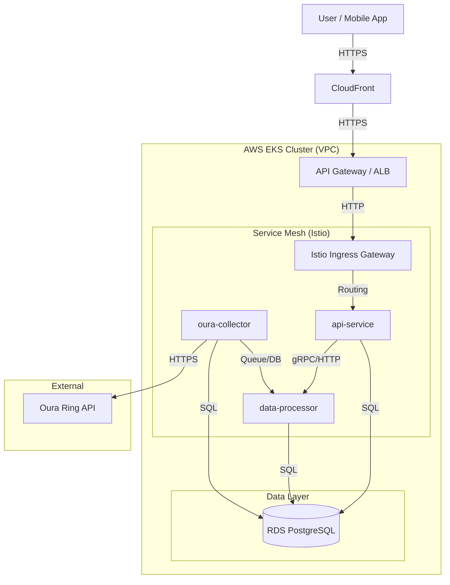

# Architecture Overview

This document provides a high-level overview of the myHealth Kubernetes Platform architecture, including the technology stack, infrastructure components, and microservices design.

---

## 🏗️ High-Level Architecture

The platform runs on **AWS EKS** and follows a microservices architecture. Traffic enters through an **AWS Application Load Balancer (ALB)** (managed by the AWS Load Balancer Controller or Istio Ingress Gateway) and is routed to services within the cluster.

---

## 🛠️ Technology Stack

| Layer | Technology | Description |
| :--- | :--- | :--- |
| **Cloud Provider** | AWS | EKS, RDS, ECR, VPC, S3, Secrets Manager |
| **Orchestrator** | Kubernetes (EKS) | Managed Kubernetes 1.28+ |
| **IaC** | Terraform | Infrastructure provisioning and state management |
| **Languages** | Go (Golang) | All microservices (`api-service`, `data-processor`, `oura-collector`) |
| **GitOps** | ArgoCD | Continuous Delivery and cluster state management |
| **Service Mesh** | Istio | Traffic management, mTLS, and observability |
| **Monitoring** | Prometheus & Grafana | Metrics collection and visualization |
| **CI** | GitHub Actions | Build, test, and security scanning pipelines |
| **Database** | PostgreSQL (RDS) | Relational data storage |

---

## 🧩 Microservices

### 1. api-service
*   **Role**: The front door of the application. Handles REST API requests from clients.
*   **Responsibilities**: Authentication, User Management, Data Retrieval.
*   **Scaling**: Horizontal Pod Autoscaler (HPA) based on CPU/Memory.

### 2. data-processor
*   **Role**: Asynchronous worker.
*   **Responsibilities**: Processes raw health data, calculates scores, handles background tasks.
*   **Scaling**: HPA based on queue depth (KEDA) or CPU.

### 3. oura-collector
*   **Role**: Scheduled job (CronJob).
*   **Responsibilities**: Fetches daily data from the Oura Ring API and stores it in the database.
*   **Schedule**: Runs every 6 hours.

---

## 🔐 Security Architecture

*   **Network**: All services run in private subnets. Ingress is strictly controlled via Load Balancers and Security Groups.
*   **Identity**: IAM Roles for Service Accounts (IRSA) allow pods to access AWS resources (like Secrets Manager) without long-lived credentials.
*   **Secrets**: Secrets are stored in AWS Secrets Manager and synced to Kubernetes via **External Secrets Operator**.
*   **Transport**: mTLS is enabled between services via Istio.

---

## 🚀 Deployment Strategy

We use a **GitOps** approach:
1.  **Code Change**: Developer pushes code to GitHub.
2.  **CI**: GitHub Actions builds the Docker image and pushes it to ECR.
3.  **Config Update**: GitHub Actions updates the Helm Chart version in the git repository.
4.  **Sync**: ArgoCD detects the change and syncs the cluster to the new state.
